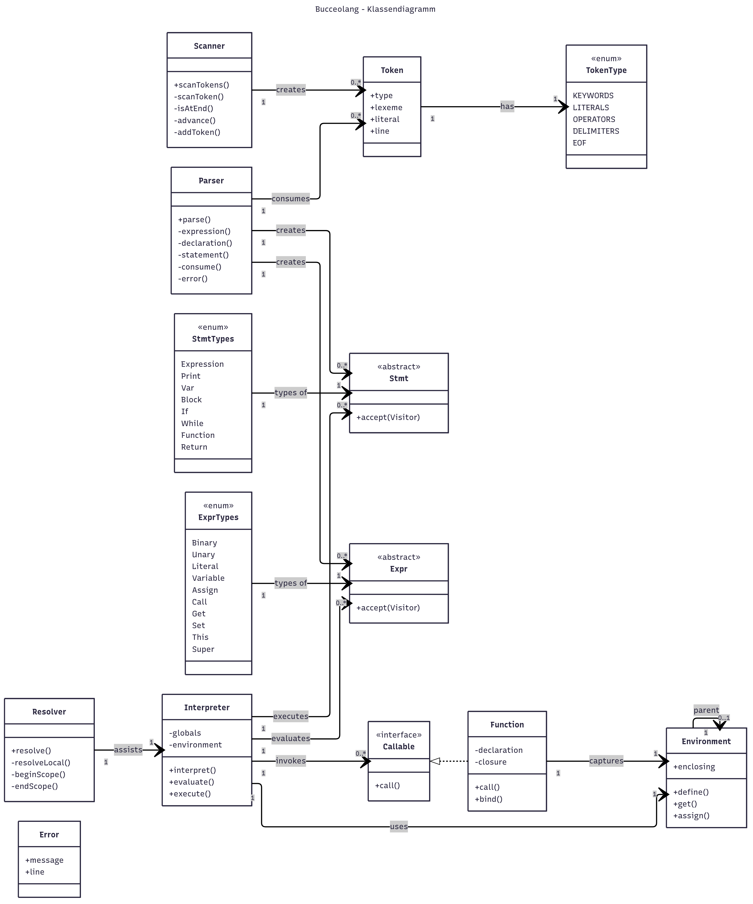
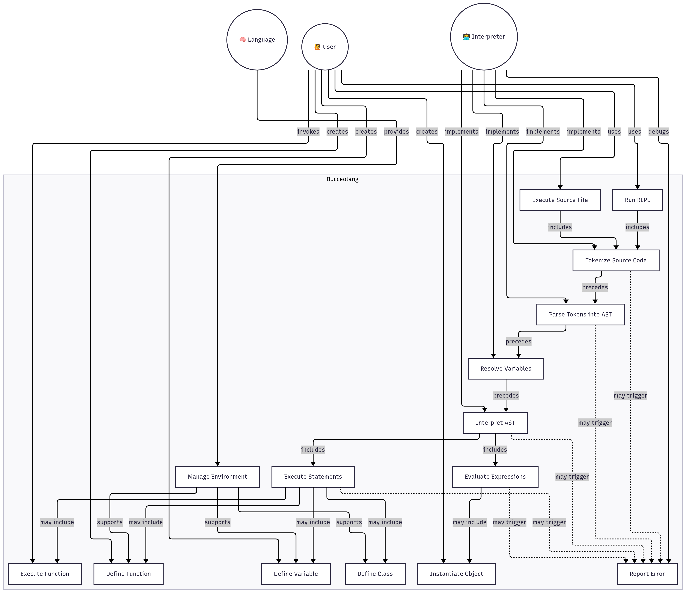

# Lox Interpreter in Rust

Ein Lox-Interpreter geschrieben in Rust, inspiriert vom Buch [_Crafting Interpreters_](https://craftinginterpreters.com/).  
**Status:** ⚠️ _Noch in Entwicklung!_

## ✅ Bisher implementierte Kernfunktionen

- [x] Scanner (Tokenisierung)
- [ ] Parser
- [ ] Statische Analyse
- [ ] Intermediate Representation (IR)
- [ ] (Optimierungen)
- [ ] Codegenerierung
- [ ] (Bytecode Virtual Machine)

## ▶️ Nutzung

Derzeit unterstützt das CLI-Tool nur das Scannen (Tokenisieren) von `.lox` Dateien:

```bash
$ ./your_program.sh tokenize test.lox
```

## 📚 Sprachspezifikation

Die Lox-Spezifikation findest du hier:  
➡️ [Offizielle Dokumentation](https://craftinginterpreters.com/the-lox-language.html)

## 📂 Projektdokumentation & Diagramme

Zur weiteren Orientierung und Projektplanung sind folgende Dokumente verfügbar:

### 📄 Dokumentation

- [📜 Pflichtenheft](./assets/pflichtenheft.md)
- [🧱 Abstrakte Struktur](./assets/abstract.md)
- [📊 Diagrammübersicht](./assets/diagramms.md)
- [📅 Besprechungsprotokoll](./assets/protokoll.md)

### 🧩 Diagramme

- 
- 

### 🖼️ Logos & Grafiken

- 
- 

---

## 📖 Verwendete Ressourcen

- 📘 [_Crafting Interpreters_ – Robert Nystrom](https://craftinginterpreters.com/)
- 💻 [CodeCrafters Interpreter-Kurs](https://app.codecrafters.io/courses/interpreter/introduction)
