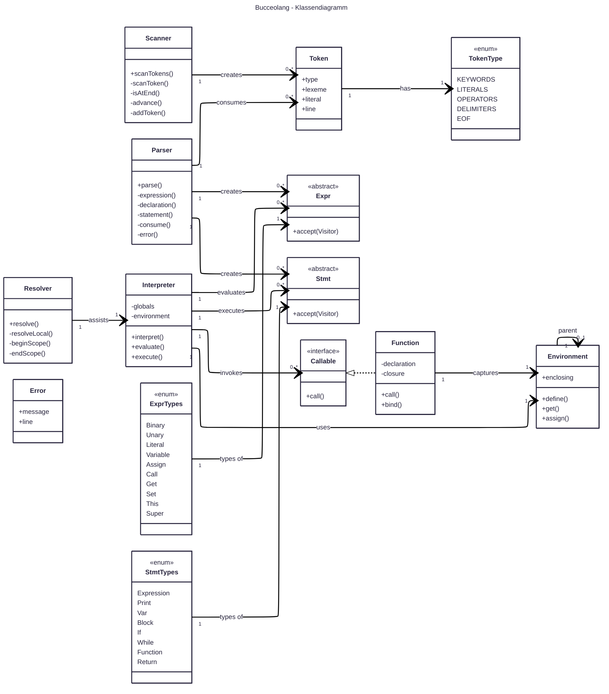
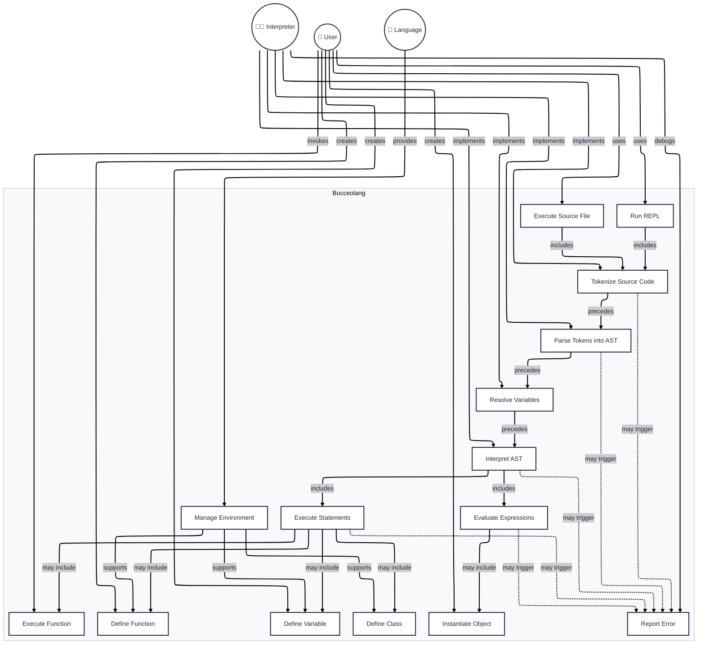

```mermaid

---
config:
  layout: elk
  theme: redux
  look: classic
title: Bucceolang - Klassendiagramm
---
classDiagram
direction LR
    class Scanner {
	    +scanTokens()
	    -scanToken()
	    -isAtEnd()
	    -advance()
	    -addToken()
    }
    class Token {
	    +type
	    +lexeme
	    +literal
	    +line
    }
    class TokenType {
	    KEYWORDS
	    LITERALS
	    OPERATORS
	    DELIMITERS
	    EOF
    }
    class Parser {
	    +parse()
	    -expression()
	    -declaration()
	    -statement()
	    -consume()
	    -error()
    }
    class Expr {
	    +accept(Visitor)
    }
    class Stmt {
	    +accept(Visitor)
    }
    class Environment {
	    +enclosing
	    +define()
	    +get()
	    +assign()
    }
    class Interpreter {
	    -globals
	    -environment
	    +interpret()
	    +evaluate()
	    +execute()
    }
    class Resolver {
	    +resolve()
	    -resolveLocal()
	    -beginScope()
	    -endScope()
    }
    class Callable {
	    +call()
    }
    class Function {
	    -declaration
	    -closure
	    +call()
	    +bind()
    }
    class Error {
	    +message
	    +line
    }
    class ExprTypes {
	    Binary
	    Unary
	    Literal
	    Variable
	    Assign
	    Call
	    Get
	    Set
	    This
	    Super
    }
    class StmtTypes {
	    Expression
	    Print
	    Var
	    Block
	    If
	    While
	    Function
	    Return
    }
	<<enum>> TokenType
	<<abstract>> Expr
	<<abstract>> Stmt
	<<interface>> Callable
	<<enum>> ExprTypes
	<<enum>> StmtTypes
    Scanner "1" --> "0..*" Token : creates
    Token "1" --> "1" TokenType : has
    Parser "1" --> "0..*" Token : consumes
    Parser "1" --> "0..*" Expr : creates
    Parser "1" --> "0..*" Stmt : creates
    ExprTypes "1" --> "1" Expr : types of
    StmtTypes "1" --> "1" Stmt : types of
    Interpreter "1" --> "1" Environment : uses
    Interpreter "1" --> "0..*" Expr : evaluates
    Interpreter "1" --> "0..*" Stmt : executes
    Resolver "1" --> "1" Interpreter : assists
    Callable <|.. Function
    Function "1" --> "1" Environment : captures
    Interpreter "1" --> "0..*" Callable : invokes
    Environment "1" --> "0..1" Environment : parent
```

```mermaid

---
config:
  theme: redux
  look: classic
  layout: elk
---
flowchart TD
Interpreter(("👨‍💻 Interpreter"))
User(("🙋 User"))
HostLanguage(("🧠 Language"))

 subgraph subGraph0["Bucceolang"]

        TokenizeSource["Tokenize Source Code"]
        ParseTokens["Parse Tokens into AST"]
        ResolveVariables["Resolve Variables"]
        InterpretAST["Interpret AST"]
        ExecuteStatements["Execute Statements"]
        EvaluateExpressions["Evaluate Expressions"]
        ExecuteFunction["Execute Function"]
        ReportError["Report Error"]
        RunREPL["Run REPL"]
        ExecuteFile["Execute Source File"]
        DefineVariable["Define Variable"]
        DefineFunction["Define Function"]
        DefineClass["Define Class"]
        InstantiateObject["Instantiate Object"]
        ManageEnvironment["Manage Environment"]
  end
    Interpreter -- implements --> TokenizeSource & ParseTokens & ResolveVariables & InterpretAST
    Interpreter -- debugs --> ReportError
    User -- uses --> RunREPL & ExecuteFile
    User -- creates --> DefineVariable & DefineFunction & InstantiateObject
    User -- invokes --> ExecuteFunction
    HostLanguage -- provides --> ManageEnvironment
    RunREPL -- includes --> TokenizeSource
    ExecuteFile -- includes --> TokenizeSource
    TokenizeSource -- precedes --> ParseTokens
    ParseTokens -- precedes --> ResolveVariables
    ResolveVariables -- precedes --> InterpretAST
    InterpretAST -- includes --> ExecuteStatements & EvaluateExpressions
    ExecuteStatements -- may include --> DefineVariable & DefineFunction & DefineClass & ExecuteFunction
    EvaluateExpressions -- may include --> InstantiateObject
    ManageEnvironment -- supports --> DefineVariable & DefineFunction & DefineClass
    TokenizeSource -. may trigger .-> ReportError
    ParseTokens -. may trigger .-> ReportError
    InterpretAST -. may trigger .-> ReportError
    ExecuteStatements -. may trigger .-> ReportError
    EvaluateExpressions -. may trigger .-> ReportError


```
