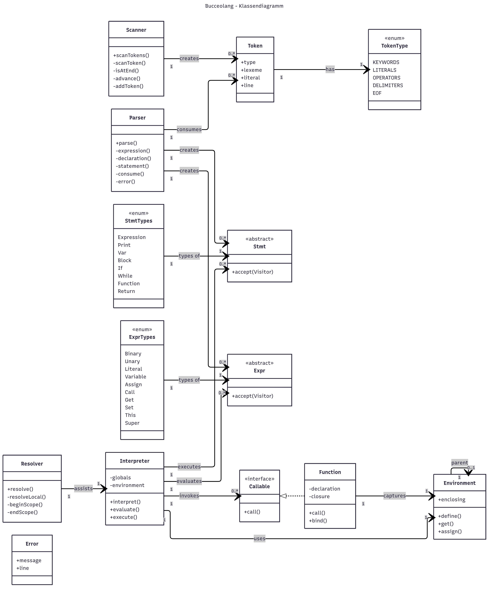
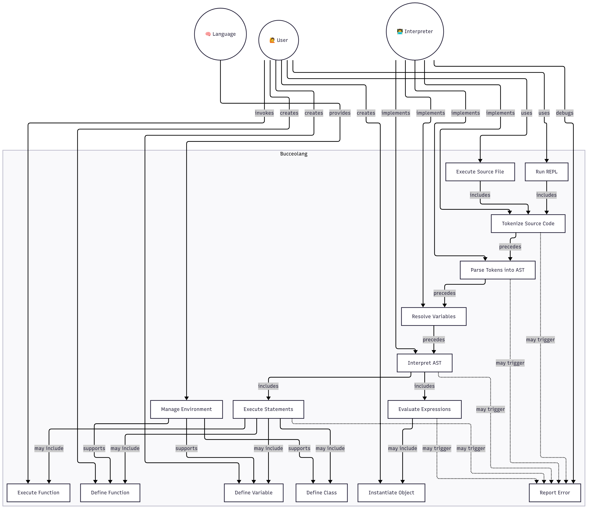

# **Bucceolang: Entwicklung eines Interpreters in Rust**

Dieses Projekt beschäftigt sich mit der Entwicklung eines Interpreters für eine Programmiersprache unter Verwendung der Programmiersprache Rust. Inspiriert durch die Ansätze und Methoden aus dem Buch [_Crafting Interpreters_](https://craftinginterpreters.com/) wird ein moderner und sicherer Ansatz zur Konstruktion eines Interpreters verfolgt, der Rusts Stärken in Speicherverwaltung, Parallelität und Systemnähe nutzt.

Der Fokus liegt auf der Implementierung eines vollständigen Interpreters, der die grundlegenden Schritte der lexikalischen Analyse, Syntaxanalyse und Ausführung umfasst. Ein abstrakter Syntaxbaum (AST) bildet die Grundlage der Evaluierung, während sowohl ein AST-basierter Interpreter als auch eine optionale Virtual Machine (VM) als Ausführungsmodelle implementiert werden. Die Wahl von Rust ermöglicht es, effiziente und sichere Lösungen zu integrieren.

Das Projekt zielt darauf ab, ein leicht erweiterbares und gut dokumentiertes System zu schaffen, das sowohl für Lernzwecke als auch als Basis für weiterführende Experimente dient. Es verbindet etablierte Konzepte des Interpreterbaus mit den modernen Möglichkeiten von Rust, um eine robuste und performante Entwicklungsplattform für Programmiersprachen zu bieten.

---

## **1. Projektbeschreibung**

### **1.1 Ziel des Projekts**

Das Ziel dieses Projekts ist die Entwicklung eines robusten und erweiterbaren Interpreters für eine speziell definierte Programmiersprache namens "Bucceolang". Der Interpreter soll in Rust implementiert werden, um von dessen Sicherheitsgarantien (z. B. Speichersicherheit ohne Garbage Collector) und hoher Performance zu profitieren.

Der Interpreter soll als eigenständige Anwendung entwickelt werden und eine klare, Dokumentierte Schnittstelle für Erweiterungen bieten.

### **1.2 Projektkontext**

Dieses Projekt entsteht im Kontext der Erforschung moderner Interpreter-Designs und der praktischen Anwendung der Programmiersprache Rust für Systemsoftware. Es dient als Grundlage für:

- **Lehre und Forschung**: Veranschaulichung von Interpreterkonzepten wie Parsing, Ausführung und Speicherverwaltung. Tieferes Verständniss für Sprachdesign.
- **Prototyping**: Ermöglichung der schnellen Entwicklung und Evaluierung neuer Sprachfeatures.
- **Erweiterbarkeit**: Bereitstellung einer Basis für zukünftige Erweiterungen (z. B. JIT-Kompilierung, statische Typanalyse oder einen primitven compiler).

### **1.3 Klassendiagramm**

### **1.4 Use-Case Diagramm**

## **2. Leistungsbeschreibung**

### **2.1 Funktionale Anforderungen**

#### **2.1.1 Grundlegende Sprachfeatures**

- **Syntaxparsing**:
  - Der Interpreter soll eine klare, dokumentierte Grammatik unterstützen.
  - Fehlermeldungen müssen aussagekräftig und positionsgenau sein.
- **Dynamische Typisierung**:
  - Unterstützung grundlegender Datentypen (Integer, Float, Boolean, String, Nil).
  - Implizite Typkonvertierung bei Operationen (z. B. `"Text" + 3 → "Text3"`).
- **Variablen & Scoping**:
  - Lexikalische Gültigkeitsbereiche (Block-Scoping).
  - Globale und lokale Variablen.
- **Kontrollstrukturen**:
  - Bedingungen (`if-else`).
  - Schleifen (`while`, `for`).
  - `break`/`continue` in Schleifen.
- **Funktionen**:
  - Definition und Aufruf von Funktionen.

#### **2.1.2 Standardbibliothek & Ein-/Ausgabe**

- Grundlegende I/O-Operationen (`print`, `read_line`).
- Mathematische Funktionen (`sin`, `sqrt`, `random`).
- Listen- und Map-Operationen (`push`, `get`, `len`).

### **2.2 Nicht-funktionale Anforderungen**

- **Performance**:
  - Effiziente Ausführung von Schleifen und rekursiven Funktionen.
  - Geringe Latenz beim Starten des Interpreters.
- **Robustheit**:
  - Keine Abstürze bei ungültigen Eingaben (graceful error handling).
  - Memory-Safety durch Rust garantiert.
- **Dokumentation**:
  - Ausführliche Code-Dokumentation mit `rustdoc`.
  - Benutzerhandbuch für die Programmiersprache.

## **3. Systemkontext und Abgrenzung**

### **3.1 Systemkontext**

- **Eingabequellen**:
  - Skriptdateien (`.lox` oder ähnlich).
  - Direkte Eingabe über Kommandozeile (falls REPL implementiert).
- **Ausgabe**:
  - Terminal (stdout/stderr).
  - Optional: Logging in Dateien.
- **Externe Abhängigkeiten**:
  - Rust-Standardbibliothek.
  - Ggf. externe Crates.

### **3.2 Abgrenzung**

- **Kein Compiler**: Der Interpreter führt Code direkt aus, keine Maschinencode-Generierung.
- **Keine IDE**: Keine integrierte Entwicklungsumgebung, aber Kompatibilität mit Texteditoren.
- **Keine Netzwerkfunktionen**: Standardbibliothek beschränkt sich auf lokale Ein-/Ausgabe.

## **4. Technische Anforderungen**

### **4.1 Entwicklungsumgebung**

- **Programmiersprache**: Rust
- **Build-System**: Cargo

### **4.2 Zielplattformen**

- **Betriebssysteme**:
  - Linux (x86_64, ARM)
- **Hardware**: Keine speziellen Anforderungen

### **4.3 Tooling & Infrastruktur**

- **Versionskontrolle**: Git (Hosting auf GitHub)
- **CI/CD**: GitHub Actions (Automatisiertes Testen ueber Rusts testing System, Test werden Stück für Stück mit der Entwicklung geschrieben)
- **Dokumentation**:
  - `rustdoc` für API-Dokumentation

## **5. Zeitmanagement**

1. Projektsetup (Rust/Cargo), GitHub-Repo, Sprachspezifikation erstellen.
2. Lexer implementieren (Tokenisierung) und testen.
3. Parser bauen (AST-Generierung), Parsing-Fehlerbehandlung, Integrationstests Lexer+Parser.
4. Interpreter entwickeln (AST-Auswertung), Unterstützung für Variablen und Kontrollstrukturen.
5. Standardbibliothek (I/O, Math, Listenfunktionen) und Basistests integrieren.
6. Optional: Virtual Machine (Bytecode-Interpreter) bauen, Performance-Optimierung.
7. Dokumentation (rustdoc, Benutzerhandbuch), finale Tests und Bugfixes.

## **6. Risikomanagement**

### **6.1 Potenzielle Risiken & Gegenmaßnahmen**

| **Risiko**                              | **Wahrscheinlichkeit** | **Auswirkung** | **Gegenmaßnahme**                                                      |
| --------------------------------------- | ---------------------- | -------------- | ---------------------------------------------------------------------- |
| Unklarheiten in der Sprachspezifikation | Mittel                 | Hoch           | Prototyping & frühzeitige Abnahme                                      |
| Performance-Probleme bei Recursion      | Hoch                   | Mittel         | Tail-Call-Optimierung oder Stack-Management                            |
| Speicherleaks durch Referenzzyklen      | Mittel                 | Hoch           | Manuelle Zyklenerkennung oder Weak-References                          |
| Unzureichende Testabdeckung             | Hoch                   | Hoch           | Automatisierte Tests mit Github actions und Rusts eigene testing suite |
